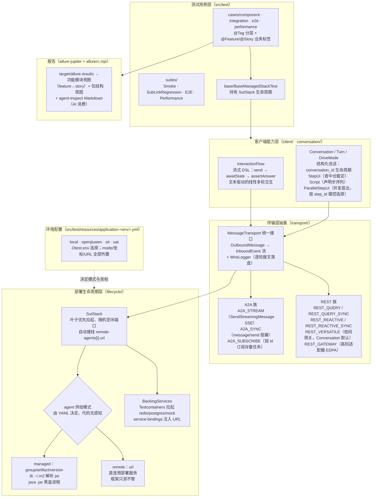

# 框架设计：能力总览与抽象层原理

本文是**认知路径**：读完能回答"这套 SIT 框架有哪几层能力、每层解决什么问题、为什么这么分层"。
动手操作见 [quickstart.md](quickstart.md)，写用例实战见 [write-testcase.md](write-testcase.md)。

## 1. 总体能力图



一句话概括分层动机：**用例只描述业务意图，客户端 DSL 只描述交互形态，传输层只关心报文怎么收发，
部署层只关心被测系统从哪来**——四层各自可替换，组合出覆盖矩阵。

## 2. 部署能力：`SutStack`（local 拉起 vs remote 直连）

`SutStack` 是被测系统（SUT）的生命周期抽象，核心设计点：

- **模式由 YAML 决定，代码无 override**：`sut.agents.<name>` 下写 `group/artifact/version` 就是
  **managed**（`ProcessLauncher` 从 `~/.m2` 解析 jar，`java -jar` 黑盒拉起，随机分配空闲端口）；
  写 `url` 就是 **remote**（直连预部署实例，框架只测不管，也不会去 stop 它）。
  同一条链路切换 managed/remote 只改 YAML，不改 Java。
- **链式自动接线**：按声明顺序叶子优先启动，把下游解析出的 base URL 自动注入上游的
  `agent-runtime.remote-agents[i].url`（前缀可按 agent 覆盖）。managed 和 remote 可以混编在一条链里。
- **backing services**：`sut.services.<name>` 声明 Testcontainers 镜像（redis、postgres、各种 mock），
  agent 通过 `service-bindings`（`url-key` + `url-template`）拿到注入地址——本地环境无需手工起依赖。
- **可控故障**：`stop(name)` / `start(name)`（同端口重启，上游接线不失效）支撑
  "下游中途被杀"这类故障注入用例；`FaultLink`（toxiproxy）做网络级故障。

```yaml
# application-local.yml（managed）            # application-sit.yml（remote）
sut:                                          sut:
  agents:                                       mode: remote
    mainplan:                                   agents:
      group: com.huawei.ascend.examples           mainplan:
      artifact: agent-travel-mainplan-a2a             url: http://7.209.189.82:13003
      version: 0.2.0-SNAPSHOT
```

## 3. 客户端能力：两种对话范式

同一套传输层之上提供两种抽象粒度，按用例的"对话结构复杂度"选择：

### InteractionFlow —— 文本驱动的流式 DSL

面向**线性、以文本为中心**的 A2A 交互。测试代码即文档：输入、期望状态、断言全部内联。

```java
InteractionFlow.of(stack.client("mainplan"))
    .send("今天天气怎么样")
        .awaitState(TaskState.TASK_STATE_INPUT_REQUIRED)
    .send("北京")
        .awaitState(TaskState.TASK_STATE_COMPLETED)
        .assertAnswer(text -> assertThat(text).isNotEmpty())
    .execute();
```

- 每个 `.send()` 开一轮；`InboundExchange` 把异步 SSE 事件流收敛成"等状态 + 取答案"的同步语义。
- **多轮续接自动判定**：上一轮停在非终态（如 `INPUT_REQUIRED`）则本轮自动携带
  `taskId + contextId` 续同一任务；到了终态则下一轮自动开新任务。`withContextId()` 可全程钉住一个 cid。
- 协议可覆盖：`.protocol(MessageProtocol.A2A_SYNC)`，或全局 `MESSAGE_PROTOCOL`（sys-prop/env）。

### Conversation —— 结构化多轮会话（versatile 对接）

面向**低码/中台编排场景**：持有 `conversation_id` 生命周期，一个会话跨多个 Turn 复用；
每轮由 `DriveMode` 决定怎么推进：

| DriveMode | 语义 | 适用 |
| --- | --- | --- |
| `StepUi`（默认） | 反应式：每步查中台 step-ui 裁定 auto / manual / 终态 | 工作流编排，步骤结构由 SUT 决定 |
| `Script` | 声明式步计数：按 `advance/select` 序列推进，不查 step-ui | 步骤已知的回放式验证 |
| `ParallelStepUi` | kickoff 后从 `_remote_invocation` 元数据派生子会话并发驱动；选择按 **step_id 键控**，腿序不对称也不会错配 | 并行编排 / 扇出场景 |

```java
TurnResult t = conv.turn("查余额").intent("查余额")
        .select("on_rec_result", Map.of("recSerialNum", "SN001"))
        .driveMode(DriveMode.stepUi())
        .run();
```

选择经验：**A2A 协议的线性多轮问答用 InteractionFlow；经网关/中台、有 step 结构与人工选择节点的
编排对话用 Conversation。** 两者最终都落到同一个 `MessageTransport`。

## 4. 传输层抽象：`MessageTransport` 与 `MessageProtocol`

传输层把"怎么把一条消息发给 SUT、怎么读回事件流"收敛为统一接口
`MessageTransport`（`OutboundMessage` → `InboundEvent` 流），上层 DSL 与协议解耦。
协议选择优先级：`.protocol(...)` 显式覆盖 → 系统属性 `MESSAGE_PROTOCOL` → 环境变量 `MESSAGE_PROTOCOL` → 默认值
（InteractionFlow 默认 `A2A_STREAM`，Conversation 默认 `REST_VERSATILE`）。

已实现协议（`MessageProtocol.isImplemented()`）：

| 协议 | 报文形态 | 典型用途 |
| --- | --- | --- |
| `A2A_STREAM` | JSON-RPC `SendStreamingMessage`，SSE 事件流 | A2A 默认；流式状态/答案断言 |
| `A2A_SYNC` | JSON-RPC `message/send`，阻塞 | 简单问答、老客户端兼容面 |
| `A2A_SUBSCRIBE` | JSON-RPC `SubscribeToTask`，SSE | 按 taskId 观察存量非终态任务（恢复/重连场景） |
| `REST_QUERY` / `REST_QUERY_SYNC` | `POST /v1/query`，`stream:true`(SSE) / `false`(JSON) | 自定义 REST 入口（FEAT-022 等） |
| `REST_REACTIVE` / `REST_REACTIVE_SYNC` | `POST /v1/query/reactive`（WebFlux） | reactive 入口的等价覆盖 |
| `REST_VERSATILE` | 低码网关 `/v1/{pid}/agents/{aid}/conversations/{cid}` | Conversation 默认传输 |
| `REST_GATEWAY` | 高码适配器 EDPA 报文 | 网关适配器语义验证 |

`DIRECT_A2A` / `DIRECT_REST` 是占位枚举，等对应适配器落地后可选用。

同一用例换协议重跑（协议等价性/透明性验证）：

```bash
./mvnw test -Dtest.env=openjiuwen -Dtest=SomeTest -DMESSAGE_PROTOCOL=rest_query
```

声明支持集的用例配 `@SupportedProtocols(...)`：当前 `MESSAGE_PROTOCOL` 不在集合内时自动跳过，
避免"协议没实现却红一片"。

配套诊断：**WireLogger** 逐轮记录每种协议的请求（渲染后的 `OutboundMessage`）与响应
（解码后事件 + 原始帧），落在 `target/sit-logs/wire/<run-id>/<sessionId>-r<round>-<protocol>.log`，
在 `application-<env>.yml` 开 `sut.wire-log.enabled: true` 启用。

## 5. 报告与标签体系

- 用例用 `@Feature("FEAT-0xx: ...")` / `@Story("...")` 打业务标签，`@Tag("component"/"integration"/...)`
  打分层标签。Allure 3 的 `allurerc.mjs` 把前者渲染成"功能模块视图"（feature → story 树，
  与 `docs/cases/` 设计文档编号对应），后者决定 Surefire/Failsafe 的选择。
- 双产物：`allure generate` 的 Awesome HTML（人看）+ `allure agent inspect` 的 Markdown（AI 看），
  同一份 `allure-results` 生成，互不干扰。详见 [quickstart.md §4](quickstart.md#4-查看-allure-报告)。

## 6. 深入阅读

- [spring-ai-ascend-integration-test-design.md](spring-ai-ascend-integration-test-design.md) — 早期总体设计
- [travel-sit-test-framework-design.md](travel-sit-test-framework-design.md) — travel 链路 SIT 框架设计
- [docs/cases/](cases/) — 逐用例设计文档（FEAT-NNN）
