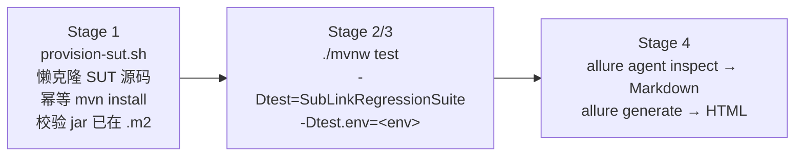

# 快速开始：环境准备 → 跑用例 → 看 Allure 报告

本文是**操作路径**：从零到一份可浏览的测试报告，只讲怎么做，不讲为什么。
框架设计原理见 [framework-design.md](framework-design.md)，写新用例见 [write-testcase.md](write-testcase.md)。

## 1. 环境准备

| 依赖 | 要求 | 说明 |
| --- | --- | --- |
| JDK | 21 | 框架与 SUT 均按 Java 21 构建；SUT 构建可用 `JAVA_HOME_21` 指定独立 JDK |
| Maven | 3.8+（`mvn` 需在 PATH） | Stage 1 供给脚本直接调用 `mvn`；跑测试用仓库自带 `./mvnw` |
| git | 任意 | Stage 1 懒克隆 SUT 源码 |
| python3 + PyYAML | 任意 | 解析 `scripts/sut/sut-sources.yml` |
| Docker | 本地环境可选 | Testcontainers 拉起 redis / postgres 等 backing service 时需要；远端环境不需要 |
| Node.js + allure CLI | 看报告需要 | 见 §3 |

## 2. 配置大模型（跑通用例的前提）

**绝大多数用例链路的终点都有一次真实 LLM 调用**——agent 没有可用的模型接入就起不来或
首轮即失败。因此跑任何用例之前，必须先让 SUT agent 拿到大模型连接属性。

框架把 `sut.java.system-properties` 下的键值以 JVM `-D` 形式注入**每一个**被拉起的 agent，
agent 侧原生解析 `${LLM_*}`。两种供给方式（二选一，推荐前者）：

```bash
# 方式一（推荐）：环境变量。密钥不进任何被 git 跟踪的文件，进程环境天然携带
export LLM_API_BASE="https://<你的模型服务地址>/v1"
export LLM_MODEL="<模型名>"
export LLM_API_KEY="<密钥>"
# 视模型服务需要：export LLM_SSL_VERIFY=false
```

```yaml
# 方式二：写进 src/test/resources/application-<env>.yml（如 application-openjiuwen.yml）
# 取消 sut.java.system-properties 下 LLM 段的注释并填入。
# ⚠️ LLM_API_KEY 是密钥：本文件被 git 跟踪，只适用于一次性本地调试，切勿提交。
sut:
  java:
    system-properties:
      LLM_API_BASE: "https://<你的模型服务地址>/v1"
      LLM_MODEL: "<模型名>"
      LLM_API_KEY: "<密钥>"
      LLM_SSL_VERIFY: "false"
```

补充说明：

- 走 HTTP 代理才能访问模型服务时，在同一段配置标准 JVM 代理属性
  （`http.proxyHost` / `http.proxyPort` / `https.proxyHost` / `http.nonProxyHosts`）。
- 远端环境（如 `application-sit.yml`，`mode: remote`）的大模型配置在**预部署的 agent 侧**，
  不在本仓库；本地 yml 的 LLM 段只影响 managed 模式拉起的进程。
- 没有配 LLM 时典型症状：agent 启动超时（`target/sit-logs/` 里 stdout 报模型连接/鉴权失败），
  或用例首轮 `awaitState` 超时。

## 3. 跑测试用例：`run-pipeline.sh`

`scripts/run-pipeline.sh` 是主入口，把四个阶段串成一条流水线：



```bash
# 完整流水线（供给 + 回归套件 + 报告）
./scripts/run-pipeline.sh --env openjiuwen

# 已有 SUT jar，跳过供给（日常迭代最常用）
./scripts/run-pipeline.sh --env openjiuwen --skip-provision

# 只做供给，不跑测试（切分支后预热 .m2）
./scripts/run-pipeline.sh --env openjiuwen --only-provision

# 只供给一次，看计划不动手（dry-run 在 provision 层）
./scripts/sut/provision-sut.sh --env openjiuwen --dry-run

# `--` 之后的参数原样透传给 mvnw，最后一个 -Dtest 生效 → 可临时换跑别的用例
./scripts/run-pipeline.sh --env openjiuwen --skip-provision -- -Dtest=SomeTest
```

要点：

- `--env <name>` 必填，对应 `src/test/resources/application-<env>.yml`，当前有 `openjiuwen` / `local` / `sit` / `uat`。
  框架的**默认 env 是 `openjiuwen`**：不显式传 `-Dtest.env` / `TEST_ENV` 时 `TestEnvironment` 即按 `openjiuwen` 解析 `application-openjiuwen.yml`。
- 测试默认跑 `SubLinkRegressionSuite`（workflow_call 组件用例 + 全部 integration 用例）。
  想跑别的套件，用 `-- -Dtest=...` 覆盖，例如 `-Dtest=SmokeTestSuite`、`-Dtest='*Travel*Test'`。
- 退出码透传自 Stage 2/3（`-Dmaven.test.failure.ignore=true` 只影响报告生成，不影响退出码）。
- Stage 1 的源码来源与构建步骤在 `scripts/sut/sut-sources.yml` 里按 env 声明；
  本机已有 checkout 时用环境变量指过去即可（`SUT_SOURCE_DIR` / `AGENT_CORE_DIR` / `AGENT_RUNTIME_DIR`），
  默认 sync 模式是 `none`，不会动你的开发树。
- 也可以绕过流水线直接 `./mvnw test -Dtest.env=openjiuwen -Dtest=...`，只是没有供给保障和报告。

### 失败排查速查

| 现象 | 先看哪 |
| --- | --- |
| Stage 1 报 jar 缺失 | `scripts/sut/sut-sources.yml` 的 steps 是否覆盖该 artifact；`--dry-run` 对照计划 |
| agent 起不来 / 超时 | `target/sit-logs/` 下每个 agent 的 stdout 日志（managed 模式） |
| 想看线上报文 | 在 `application-<env>.yml` 开 `sut.wire-log.enabled: true`，产物在 `target/sit-logs/wire/<run-id>/` |
| 用例失败定位 | `target/allure-results/` 已生成，直接进 §3 看报告 |

## 4. 查看 Allure 报告

### 4.1 安装 allure CLI（一次性）

报告是 **Allure 3**（`allure-maven` 3.0.2 + `allurerc.mjs`），CLI 也必须是 3.x：

```bash
# 推荐：nvm 管理 Node 后全局安装
npm install -g allure@3
allure --version    # 期望 3.x
```

`run-pipeline.sh` Stage 4 会自动尝试加载 `~/.nvm/nvm.sh` 再找 `allure`，
所以装在 nvm 管理的 Node 下即可，不需要把路径写进 crontab/systemd。

> 注意：`pom.xml` 里还有一个 `allure-report` Maven profile（`./mvnw allure:report -Pallure-report`），
> 它会自动下载 Node + Allure 二进制，仅作备用；流水线不走它。

### 4.2 报告产物

`run-pipeline.sh` Stage 4 从 `target/allure-results/` 产出两份互补产物：

| 产物 | 生成命令 | 用途 |
| --- | --- | --- |
| `target/allure-report-md/` | `allure agent inspect` | Markdown + JSONL 清单，**给 AI 消费**（失败分析、喂给编码助手） |
| `target/allure-report/` | `allure generate` | **给人看**的 Awesome HTML：根 `index.html` 是多报告切换器，下挂两个子视图 |

两个 HTML 子视图（由 `allurerc.mjs` 声明，各自独立分组）：

- **功能模块视图**（`awesome-behaviors`，按 epic/feature/story 分组）——主视图。
  用例上的 `@Feature("FEAT-022: ...")` / `@Story(...)` 标签直接渲染成 feature → story 树。
- **包结构视图**（`awesome-packages`，按 package/class/method 分组）——按测试类索引的平铺清单。

### 4.3 本地起服务

```bash
# 方式一（推荐，最省事）：一次性生成并起 HTTP 服务，自动开浏览器
# allurerc.mjs 会被自动发现，无需 -c，直接得到与流水线一致的双视图报告
allure serve target/allure-results

# 方式二：基于已生成的静态站点，用任意静态服务器 host
allure open target/allure-report        # allure 自带
# 或
python3 -m http.server 8000 --directory target/allure-report
```

> 不建议直接双击 `target/allure-report/index.html`（`file://` 打开）——
> 浏览器对 `file://` 的 fetch/模块加载限制会让报告数据加载不出来，必须走 HTTP。

### 4.4 远端 Linux 跑测试，本机 Windows 看报告（`ssh -L`）

报告在远端 Linux 机器上生成，Windows 笔记本上用 **SSH 本地端口转发** 把远端的 HTTP 端口映射到本地：

```bash
# 1) 远端：起静态服务，绑定一个端口（例如 18080）
#    用 allure open 指定端口，或 python http.server 均可
allure open target/allure-report --port 18080
# 或：python3 -m http.server 18080 --directory target/allure-report
```

```powershell
# 2) Windows 本机（PowerShell / CMD / Git Bash 均可）：
#    把远端 18080 映射到本机 18080；建立期间保持这个 ssh 会话不断开
ssh -L 18080:127.0.0.1:18080 user@<远端Linux地址>

# 若本机 18080 被占用，左侧换个本地端口即可，例如：
ssh -L 28080:127.0.0.1:18080 user@<远端Linux地址>
```

```text
# 3) Windows 浏览器打开：
http://localhost:18080/          # 左侧本地端口是多少就写多少
```

原理：`ssh -L <本地端口>:<目标host>:<目标端口>` 在本地监听一个端口，
收到的流量经 SSH 隧道加密转发到远端 sshd，再由远端机器代连 `127.0.0.1:18080`——
所以远端的 HTTP 服务**只绑定 loopback 也安全可达**，无需对公网/内网开放测试报告端口。

补充技巧：

```powershell
# 常用可复用：-N 不开 shell、-f 后台（Windows OpenSSH 也支持）
ssh -N -L 18080:127.0.0.1:18080 user@<远端Linux地址>

# 跳板场景：远端机器还要再跳一层才到跑测试的机器，把中间那段也写进 -L 目标即可
ssh -L 18080:<测试机内网IP>:18080 user@<跳板机>
```

## 5. 常见组合速查

```bash
# 日常迭代：只改了用例代码
./scripts/run-pipeline.sh --env openjiuwen --skip-provision -- -Dtest=MyNewTest && allure serve target/allure-results

# 换了 SUT 分支：先供给再全量回归
./scripts/run-pipeline.sh --env openjiuwen

# 远端 SIT 环境（application-sit.yml 是 mode: remote，不拉起本地进程，无需 Docker）
./scripts/run-pipeline.sh --env sit --skip-provision

# 失败用例喂给 AI 分析
cat target/allure-report-md/index.md   # 再按需打开具体用例的 .md
```
