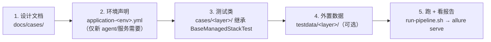

# 写一个新用例：基于抽象层的实战路径

本文假设你已经读过 [framework-design.md](framework-design.md)，目标是把一个新场景落成
"设计文档 + 可跑用例 + 报告里看得见"。

## 1. 五步走



### Step 1 — 设计文档

在 `docs/cases/` 下按现有 FEAT-NNN 文档格式补一篇（背景、前置条件、步骤、期望）。
文档编号与用例的 `@Feature` 标签对应，报告里的 feature 树就能回溯到设计。

### Step 2 — 环境声明（仅当引入了新 agent 或 backing service）

编辑 `src/test/resources/application-<env>.yml`：

```yaml
sut:
  services:                          # 需要容器化依赖时声明（Testcontainers）
    redis:
      image: redis:7-alpine
      port: 6379
  agents:
    my-agent:
      group: com.example             # managed：三坐标，从 ~/.m2 解析
      artifact: my-agent-a2a
      version: 0.1.0-SNAPSHOT
      service-bindings:              # 把容器地址注入 agent 的某个配置项
        redis:
          url-key: my-agent.redis-url
          url-template: "redis://{{url}}"
    # 或者 remote：url: http://host:port  —— 与三坐标二选一
```

新 artifact 还要让供给流水线知道怎么构建：往 `scripts/sut/sut-sources.yml` 对应 env 的
`steps` 加一行 `- { source: ..., module: ... }`。

### Step 3 — 测试类

放在 `src/test/java/com/huawei/ascend/sit/cases/<layer>/`，继承 `BaseManagedStackTest`
（持有 `stack` / `config`，管理 SUT 生命周期），打两套标签：

```java
@Feature("FEAT-099: 我的新场景")                       // Allure 功能模块视图
@Story("xx.some-slug: 一句话描述")
@Tag("integration")                                    // Surefire 分层选择
class MyNewScenarioTest extends BaseManagedStackTest {
    // ...
}
```

分层约定：

| 目录 | `@Tag` | 语义 | 默认运行 |
| --- | --- | --- | --- |
| `cases/component/` | `component` | 单 agent、不依赖链路 | `mvnw test` |
| `cases/integration/` | `integration` | 多 agent 链 / 跨组件 | `mvnw test` |
| `cases/e2e/` | `e2e` | 需真实 profile 环境 | `mvnw verify` |
| `cases/performance/` | `performance` | 性能基准 | 专用 suite |

### Step 4 — 选客户端抽象

**A2A 线性多轮** → `InteractionFlow`：

```java
InteractionFlow.of(stack.client("mainplan"))
    .send("帮我规划北京两日游")
        .awaitState(TaskState.TASK_STATE_INPUT_REQUIRED)
    .send("预算 2000")
        .awaitState(TaskState.TASK_STATE_COMPLETED)
        .assertAnswer(text -> assertThat(text).contains("北京"))
    .execute();
```

**网关/中台结构化编排** → `Conversation`（经 `Conversation.on(stack)` 取网关 + 中台地址）：

```java
try (Conversation conv = Conversation.on(stack)
        .identity(ConversationIdentity.loadDefault())
        .timeout(Duration.ofSeconds(30))
        .open()) {
    TurnResult t = conv.turn("查余额").intent("查余额")
            .select("on_rec_result", Map.of("recSerialNum", "SN001"))
            .driveMode(DriveMode.stepUi())
            .run();
    assertThat(t.terminalStep().isWorkflowComplete()).isTrue();
}
```

**换协议验证同一语义** → `.protocol(MessageProtocol.A2A_SYNC)` 显式覆盖，
或跑的时候 `-DMESSAGE_PROTOCOL=rest_query`；协议敏感的用例加
`@SupportedProtocols(...)` 让不支持的协议自动跳过而不是报错。

**外置输入** → 大段 prompt / 契约样本放 `src/test/resources/testdata/<layer>/...`，
用例里加载，不要把报文糊在 Java 里。

### Step 5 — 跑起来、看报告

```bash
./scripts/run-pipeline.sh --env openjiuwen --skip-provision -- -Dtest=MyNewScenarioTest
allure serve target/allure-results     # 功能模块视图里应能看到 FEAT-099 节点
```

## 2. 校验清单

- [ ] 设计文档编号 ↔ `@Feature` 标签一致
- [ ] 分层目录 ↔ `@Tag` 一致（决定被哪个 suite/命令选中）
- [ ] 新 agent 在目标 env 的 yml 里有坐标或 URL，且 `sut-sources.yml` 有构建步骤
- [ ] 协议相关断言不绑死在一种传输上（或已用 `@SupportedProtocols` 声明边界）
- [ ] `run-pipeline.sh` 退出码为 0，报告里能看到且归类正确
- [ ] 密钥不落库：LLM key 等一律走环境变量（`LLM_*`），yml 里不留明文

## 3. 参考样板

- 单 agent 起步：[docs/cases/reactagent/A-01-agent-card-discovery.md](cases/reactagent/A-01-agent-card-discovery.md)
- InteractionFlow 多轮：`cases/component/workflow_call/` 与 `cases/integration/workflow_call/AbstractExpenseReviewAcceptanceTest.java`
- Conversation 编排：`cases/integration/deepagent_deepresearch/custom_rest/`
- 协议切换测试基础设施：`src/test/java/com/huawei/ascend/sit/transport/` 下的 `SupportedProtocols` / `ProtocolSupportExtension`
